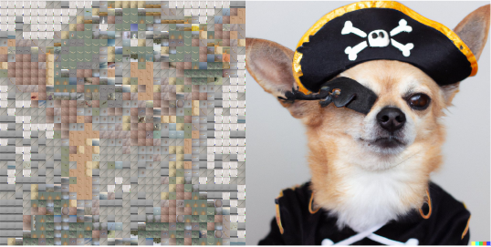
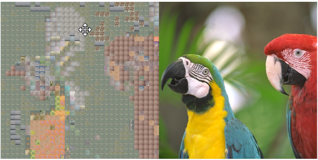
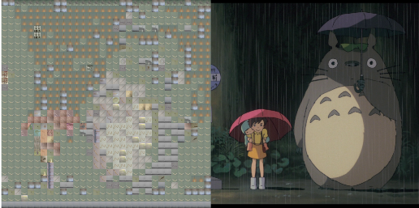

# Authomatic Photomosaic with perceptual metrics

In this project a [Photomosaic](https://en.wikipedia.org/wiki/Photographic_mosaic) is automatically created giving a source image and using CIFAR100  images for the mosaic. In order to compute similarity between images the perceptual metric DIST is used.
## Table of Contents

- [Installation](#installation)
- [Usage](#usage)
- [Images](#images)

## Installation

In addition to the usual computer vision libraries (Numpy, Pytorch, etc), this project use [PIQ](https://github.com/photosynthesis-team/piq) image quality assessment library.

## Usage

Check-up the collage_dist.ipynb notebook. Attention! this code takes ~4 hours to compute a 1024x1024 photomosaic using a GPU with 24Gb of VRAM.

## Images

Here are three are some results:

